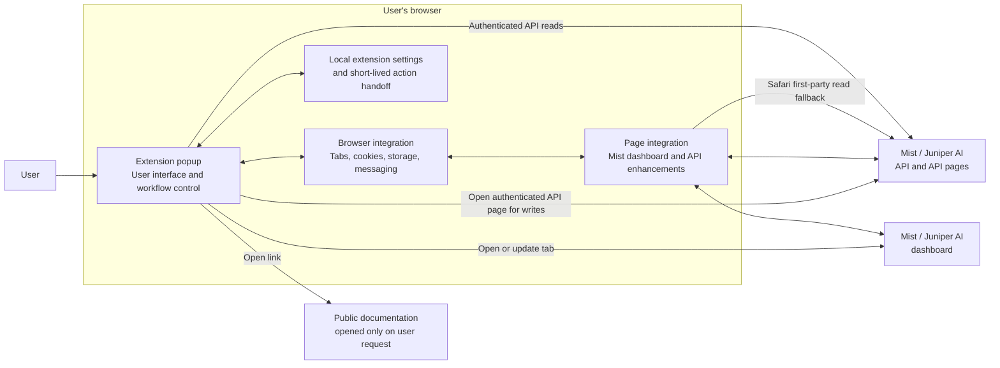

# Mist Browser Extension — Architecture and Security Overview

**Audience:** Customers, enterprise architects, and security reviewers  
**Version reviewed:** 6.1.1  
**Last validated:** 2026-07-15

## 1. Purpose and scope

The Mist Browser Extension is an independent, open-source browser extension that simplifies access to Juniper Mist dashboards and APIs. It runs locally in the user's browser and does not require an extension-operated backend service.

The extension provides:

- context-aware links from Mist dashboard pages to the corresponding API endpoints;
- quick access to organization, site, and object identifiers;
- display and editing of API query parameters on Mist API pages;
- discovery of active Mist browser sessions;
- user and organization API-token management;
- API-token identity and usage inspection; and
- optional page enhancements such as dark mode, ID links, readable timestamps, and Copy JSON.

The extension does not replace Mist authentication or authorization. Every operation remains subject to the permissions of the signed-in Mist user or the API token supplied by the user.

## 2. High-level architecture

The architecture has four browser-local roles:

| Role | Responsibility |
|---|---|
| Popup application | Presents the API, Accounts, Tools, Settings, and About views and coordinates user actions. |
| Browser integration | Uses standard WebExtension APIs to inspect the active tab, open pages, discover Mist sessions, store preferences, and exchange internal messages. |
| Page integration | Adds optional functionality to supported Mist pages and provides Safari-specific access from the page's authenticated context. |
| Background process | Performs browser-privileged cookie queries and updates the extension badge according to the active page. |

There is no separate application server, proxy, cloud database, or extension-managed identity service.

## 3. Main operating flows

### Context-aware API navigation

The extension reads the active tab's URL when the popup opens. For supported Mist dashboard routes, it derives relevant organization, site, and object identifiers and builds links to the matching API pages. On a Mist API page, a local API metadata index provides supported query parameters and links to public Juniper API documentation.

This processing is performed locally. Reading the active URL does not send the URL to the extension developer or to an analytics service.

### Authenticated session and API reads

On Chrome/Chromium and Firefox, the extension uses permitted Mist cookies and credentialed HTTPS requests to identify active sessions and retrieve account, privilege, usage, and API-token information from the corresponding Mist cloud.

Safari applies stricter cross-origin credential behavior. When a direct read is unavailable, the extension asks an open Mist tab in the same cloud to perform a GET request from that page's authenticated first-party context. This fallback accepts GET requests only.

Session information and API responses are held in the popup's memory and are not persisted by the extension.

### API-token creation and deletion

State-changing operations use the authenticated Mist API page rather than an extension-operated proxy:

1. The user initiates the action in the popup.
2. The extension records the method, exact target URL, timestamp, and optional request body in local extension storage.
3. It opens the corresponding Mist API page.
4. A page integration script verifies that the URL matches and that the request is no more than 15 seconds old.
5. The script fills and submits the Mist page's own authenticated form.

The handoff is cleared before form submission. An expired action is rejected; a stored action that is not evaluated is overwritten by a later action or removed with the extension's local data.

### API-token inspection tool

The optional Tools workflow cannot determine an API token's cloud locally. When the user asks to inspect a token, the extension sends it sequentially over HTTPS to the configured Mist/Juniper API hosts until a host accepts it or the list is exhausted. This configured list includes supported production clouds and configured staging/integration hosts within the permitted domain families. The token is held in memory only and is not stored in extension storage.

## 4. Browser permissions

All three browser packages request the same functional permissions. Access is limited to HTTPS pages within the declared Mist/Juniper host patterns.

| Permission or host pattern | Justification |
|---|---|
| `cookies` | Detect signed-in Mist clouds and use the existing authenticated session. Cookie access is restricted by the declared Mist/Juniper host permissions. |
| `tabs` | Read the active Mist page URL, open or update dashboard/API/documentation tabs, and communicate with matching Mist tabs for Safari session and read fallbacks. |
| `storage` | Store user preferences and the short-lived handoff for a user-initiated API action. |
| `clipboardWrite` | Write content selected by the user—such as an identifier or JSON response—to the system clipboard. The extension does not request clipboard-read access. |
| `https://*.mist.com/*` | Support commercial Mist dashboard and API hosts under `mist.com`. |
| `https://*.mistsys.com/*` | Support configured Mist integration and staging hosts under `mistsys.com`. |
| `https://*.mist-federal.com/*` | Support configured Mist Federal dashboard and API hosts. |
| `https://*.ai.juniper.net/*` | Support Juniper AI cloud hosts, including the configured DC, JSI, and Routing services. |

Firefox also declares the same four host patterns as optional host permissions so access can be requested through Firefox's permission workflow.

## 5. Data handling and privacy

The extension contains no analytics, telemetry, advertising, tracking, or crash-reporting integration. It does not transmit data to the developer and does not use a third-party service to process Mist data.

| Data | Handling |
|---|---|
| Mist session cookies | Read locally for supported Mist/Juniper domains, kept in browser memory, and not copied to developer-controlled infrastructure or persisted by the extension. Browser-authenticated requests send them only to their applicable Mist/Juniper origin. |
| Account, privilege, usage, and token metadata | Retrieved from configured Mist/Juniper HTTPS API endpoints, displayed in the popup, and retained in memory only. |
| API token entered in Tools | Retained in memory only and sent to configured Mist/Juniper API hosts as described in the token-inspection flow above. |
| User preferences | Stored in browser extension storage until the user clears extension data or uninstalls the extension. |
| Pending API action | Stored locally with an exact URL and timestamp; accepted only within 15 seconds and cleared before submission. It is never sent to the extension developer. |
| Clipboard data | Written only following a user copy action. The extension does not read the clipboard. |

Normal session-based operations target the cloud detected from the user's Mist session or active Mist page. The token-inspection tool is the exception because it must discover the token's issuing cloud.

The current 6.1.1 user interface does not run an automatic GitHub release check. Links in the About view open public documentation, integration, repository, or release pages in a normal browser tab only when selected by the user; those sites then operate under their own privacy terms.

For the complete privacy statement, see [PRIVACY.md](PRIVACY.md).

## 6. Security controls and trust boundaries

- **Origin restriction:** manifests and runtime checks limit privileged behavior to configured HTTPS Mist/Juniper domain families.
- **Same-cloud selection:** the Safari read fallback prefers an open dashboard tab in the same cloud as the requested API host.
- **Read/write separation:** the Safari content bridge accepts GET only; state-changing actions use the Mist API page's own authenticated form.
- **Write-action validation:** API-page automation requires an exact URL match and a maximum action age of 15 seconds.
- **Internal messaging:** privileged message handlers reject an explicit extension sender-ID mismatch, and the manifests do not expose an externally connectable message interface.
- **Content security policy:** extension pages allow scripts and objects from the extension itself only.
- **Data minimization:** sessions, API responses, and user-entered API tokens remain in memory; only preferences and short-lived workflow state use local storage.
- **Opt-in page changes:** dashboard dark mode and API-page enhancements are disabled by default.

The principal trust boundary is the browser extension itself: it has access to authenticated Mist pages and sessions within the declared host scope. Customers should therefore deploy it through their normal browser-extension governance and store allowlisting processes. Page enhancements and API-form automation also depend on Mist page structures and may require an extension update if those structures change.

## 7. Browser support, distribution, and updates

The extension is implemented as a WebExtension with packages for Chrome/Chromium, Firefox, and Safari. Most logic is shared; browser-specific adapters handle cookie stores, background execution, messaging, and Safari's first-party credential requirements.

Current store distribution:

- [Chrome Web Store](https://chromewebstore.google.com/detail/mist-extension/ejhpdcljeamillfhdihkkmoakanpbplh) for Chrome and compatible Chromium-based browsers, subject to each browser's enterprise policy;
- [Firefox Add-ons](https://addons.mozilla.org/en-US/firefox/addon/mist-extension/); and
- [Apple App Store](https://apps.apple.com/app/mist-extension/id6782687846) for the Safari extension's macOS application wrapper.

Store-installed copies receive updates through the browser or operating system's standard store-update mechanism. New packages are submitted through the applicable store publication, policy, signing, and review process before distribution. Enterprise administrators remain in control of extension installation and update policy on managed devices.

The source code is public at [Mist-Automation-Programmability/mist_browser_extension](https://github.com/Mist-Automation-Programmability/mist_browser_extension) and is licensed under the [MIT License](LICENSE). The extension is an independent open-source project and is not an official Juniper Networks product.

## 8. Support and document status

Questions, defect reports, and feature requests can be submitted through the project's [GitHub issue tracker](https://github.com/Mist-Automation-Programmability/mist_browser_extension/issues).

This document describes the behavior verified in version 6.1.1 from the browser manifests, popup services, background scripts, page integration scripts, and privacy statement. It is a technical architecture overview, not a certification, penetration-test report, service-level agreement, or statement of a customer's regulatory compliance.
