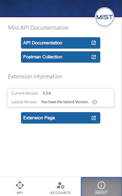
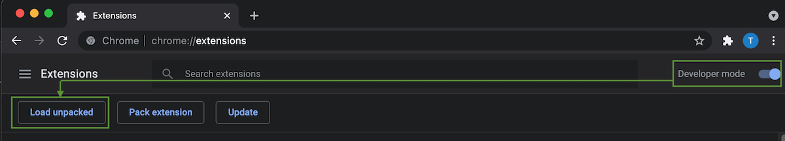
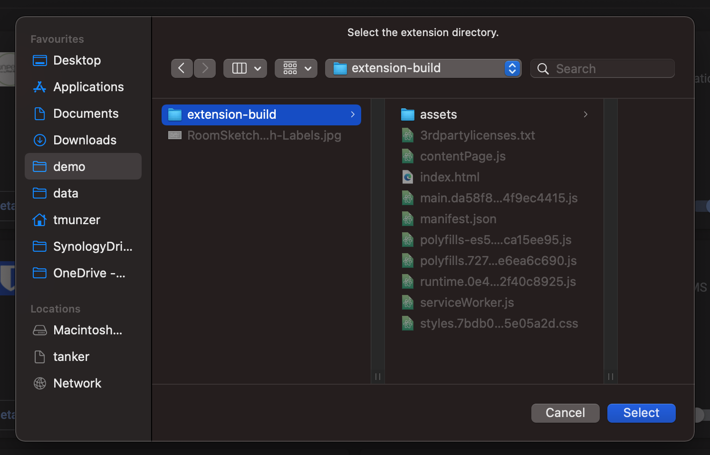

# Mist Chrome Extension
Chrome extension to get easier access to Mist APIs and Mist API Tokens.
 
# Features
## API Tab
* Quick access to the Mist IDs (org_id, site_id and object_id) from the current Mist dashboard page
* Direct access to the Mist API Pages (Django) from the current Mist dashboard page

## Account Tab
* List all the current valid Mist session in the web browser for manage.mist.com, manage.eu.mist.com, manage.gc1.mist.com
* Manage User API Token (list / delete / create)
* Manage Org API Token (list / delete / create)

## About Tab
* Quick access to the Mist API documentation (Mist official documentation, Postman documentation, OpenAPI documentation)
* Version check from the extension to know if a new version is available, and download new versions directly from the extension

# Installation
This extension is not yet available on the [Chrome Web Store](https://chrome.google.com/), but it is possible to install it in Chrome / Chromium (Edge, Brave, Sidekick, ...) web browsers. To do so:
1. Download the file `extension-build.zip` from the [latest release](https://github.com/tmunzer/mist_chrome_extension/releases)
2. Unzip the downloaded archive
3. Go to the web browser Extensions Page: <a href="chrome://extensions" target="_blank">chrome://extensions</a> 
4. Enable the **Developper Mode**

5. Click **Load Unpacked** and select the unzipped folder

6. The extension is ready to use!

